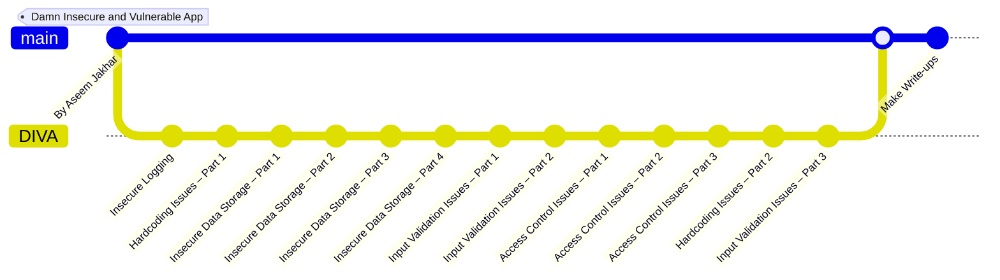

# Damn Insecure and Vulnerable App (DIVA)

This directory contains my write-ups for DIVA (Damn Insecure and Vulnerable App). You can download the APK from the [GitHub repository](https://github.com/0xArab/diva-apk-file) or directly via [this link](./Files/DIVA.apk).

## Workflow

Happy learning!