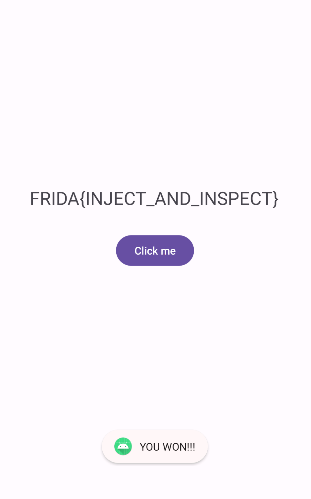

# Challenge 0x3

Let's dive into the source code and break it down for easier understanding:
```java
public class MainActivity extends AppCompatActivity {
    @Override // androidx.fragment.app.FragmentActivity, androidx.activity.ComponentActivity, androidx.core.app.ComponentActivity, android.app.Activity
    public void onCreate(Bundle savedInstanceState) {
        Button btn = (Button) findViewById(C0498R.id.button);
        btn.setOnClickListener(new View.OnClickListener() { // from class: com.ad2001.frida0x3.MainActivity.1
            @Override // android.view.View.OnClickListener
            public void onClick(View v) {
                if (Checker.code == 512) {
                    Toast.makeText(MainActivity.this.getApplicationContext(), "YOU WON!!!", 1).show();
                    try {
                        MainActivity.this.f103t1.setText(decryptedString);
                        return;
                    }
                }
                Toast.makeText(MainActivity.this.getApplicationContext(), "TRY AGAIN", 1).show();
            }
        });
    }
}
```
In this code, the `onClick` method of the button checks if the `Checker.code` equals `512`. If true, it displays a "YOU WON!!!" message and sets the text of a `TextView` to a decrypted string. Otherwise, it displays a "TRY AGAIN" message.

Now, let's look at the `Checker` class:
```java
public class Checker {
    static int code = 0;
    public static void increase() {
        code += 2;
    }
}
```

The `Checker` class has a static variable `code`, which starts at `0`. The `increase()` method increments `code` by `2`.

Since there is no direct way to call `increase()` from the `MainActivity`, we have two options to solve the challenge:
1. Directly setting `code` to `512`.
2. Using `increase()` to increment `code` to `512`.

---
**Directly Setting `code` to `512`**  

Here's a JavaScript snippet using Frida to set `code` to `512`:
```js
Java.perform(() => {
    var Activity = Java.use('com.ad2001.frida0x2.Checker');
    Activity.code.value = 512;
});
```
This script hooks into the `Checker` class and directly sets the value of `code` to `512`, ensuring the condition in `MainActivity` is met. 

---
**Using `increase()` to Increment `code` to `512`**

Here's a JavaScript snippet using Frida to call `increase()` enough times to set `code` to `512`:
```js
Java.perform(() => {
    var Activity = Java.use('com.ad2001.frida0x3.Checker');
    for (var i = 0; i < 256; i++) {
        Activity.increase();
    }
});
```

This script hooks into the `Checker` class and calls the `increase()` method 256 times, ensuring the value of `code` reaches `512`.


While there are alternative ways to retrieve the flag, such as decrypting the string manually, the purpose here is to demonstrate the power of Frida in hooking and manipulating Android methods.

Happy hooking!