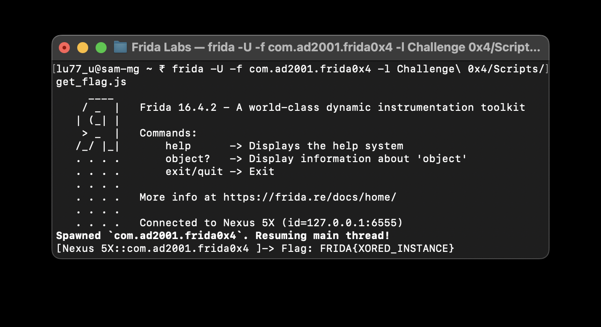

# Challenge 0x4

Let's dive into the source code and break it down for easier understanding:
```java
public class Check {
    public String get_flag(int a) {
        if (a == 1337) {
            return new String(decoded);
        }
        return "";
    }
}
```
In this code, the `get_flag` method checks if the input integer `a` equals `1337`. If it does, the method returns a decoded string; otherwise, it returns an empty string. Unlike previous challenges, this method is not static, so we need to create an instance of the `Check` class to call `get_flag`.

**Hooking into `get_flag()`**  

To interact with the `get_flag` method, we can use Frida to create an instance of the `Check` class and call the method with the correct argument. Here's how you can do it:
```js
Java.perform(() => {
    var Check = Java.use('com.ad2001.frida0x4.Check');
    const check = Check.$new();
    var result = check.get_flag(1337);
    console.log("Flag: " + result);
});
```

Once you execute this, the flag will be printed in your terminal:


While there are other methods to retrieve the flag, such as manually decrypting the string, this approach demonstrates the power and flexibility of Frida in real-time interaction with Android applications.

Happy hooking!