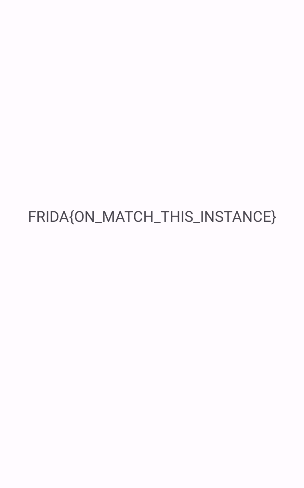

# Challenge 0x5

Let's dive into the source code and break it down for easier understanding:
```java
public class MainActivity extends AppCompatActivity {
    @Override // androidx.fragment.app.FragmentActivity, androidx.activity.ComponentActivity, androidx.core.app.ComponentActivity, android.app.Activity
    public void onCreate(Bundle savedInstanceState) {
        this.f128t1 = (TextView) findViewById(C0499R.id.textview);
    }
    public void flag(int code) {
        if (code == 1337) {
            try {
                this.f128t1.setText(decryptedText);
            } catch (Exception e) {
                e.printStackTrace();
            }
        }
    }
}
```

In this code, the `flag` method checks if the `code` equals `1337`. If it does, it sets the text of a `TextView` to a decrypted string. However, the `flag` method is not called anywhere in the `MainActivity`, so we need to invoke it manually.

Initially, you might try to directly hook and invoke the `flag` method using the following JavaScript:
```js
Java.perform(function() {
    var MainActivity = Java.use('com.ad2001.frida0x5.MainActivity');
    var main = MainActivity.$new();
    main.flag(1337);
});
```
However, this approach fails with an error because creating multiple instances of `MainActivity` is problematic, as it consumes a lot of resources and can lead to crashes or unexpected behavior.
.jpg)

To resolve this, we need to hook into the currently running instance of `MainActivity` and invoke the `flag` method on it. Here’s how you can do it:
```js
Java.perform(() => {
    Java.choose('com.ad2001.frida0x5.MainActivity', {
        onMatch: function(instance) {
            instance.flag(1337);
        },
        onComplete: function() {}
    });
});
```
When you execute this script, it will search for the currently running instance of `MainActivity`, invoke the `flag` method with the correct code, and display the decrypted text in the `TextView`.


Happy hooking!