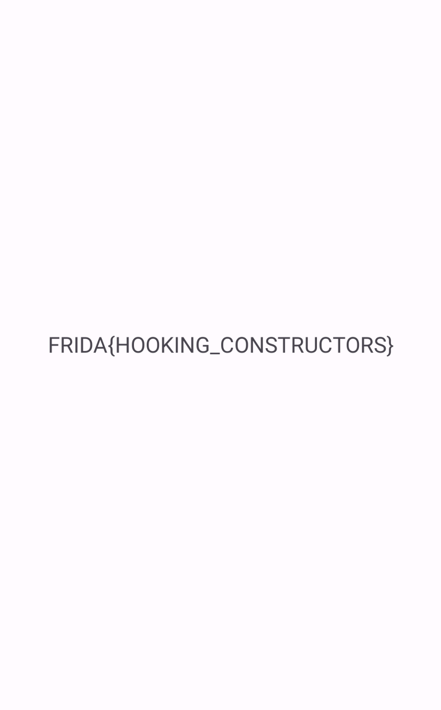

# Challenge 0x7

Let's break down the challenge and approach to solve it:
```java
public class MainActivity extends AppCompatActivity {
    @Override // androidx.fragment.app.FragmentActivity, androidx.activity.ComponentActivity, androidx.core.app.ComponentActivity, android.app.Activity
    public void onCreate(Bundle savedInstanceState) {
        this.f103t1 = (TextView) findViewById(C0497R.id.textview);
        Checker ch = new Checker(123, 321);
        try {
            flag(ch);
        }
    }
    public void flag(Checker A) throws NoSuchPaddingException, NoSuchAlgorithmException, InvalidKeyException, IllegalBlockSizeException, BadPaddingException {
        if (A.num1 > 512 && 512 < A.num2) {
            this.f103t1.setText(decrypted);
        }
    }
}
```
In this code, within `onCreate`, a `Checker` object is instantiated with values `123` and `321`, and then passed to the `flag` method. The `flag` method checks whether `num1` and `num2` are both greater than `512`. Since the original values (`123` and `321`) don't meet this condition, the check fails.

To make the check pass, we need to create our own instance of the `Checker` class with values greater than `512` and then pass it to the `flag` method.

Here’s how you can achieve this using Frida:
```js
Java.perform(() => {
    Java.choose('com.ad2001.frida0x7.MainActivity', {
        onMatch: function(instance) {
            var Check = Java.use('com.ad2001.frida0x7.Checker');
            const check = Check.$new(550, 550);
            instance.flag(check);
        },
        onComplete: function() {}
    });
});
```

When you execute this script, the `flag` method will be triggered with a `Checker` object that passes the check, displaying the decrypted text.


Happy hooking!