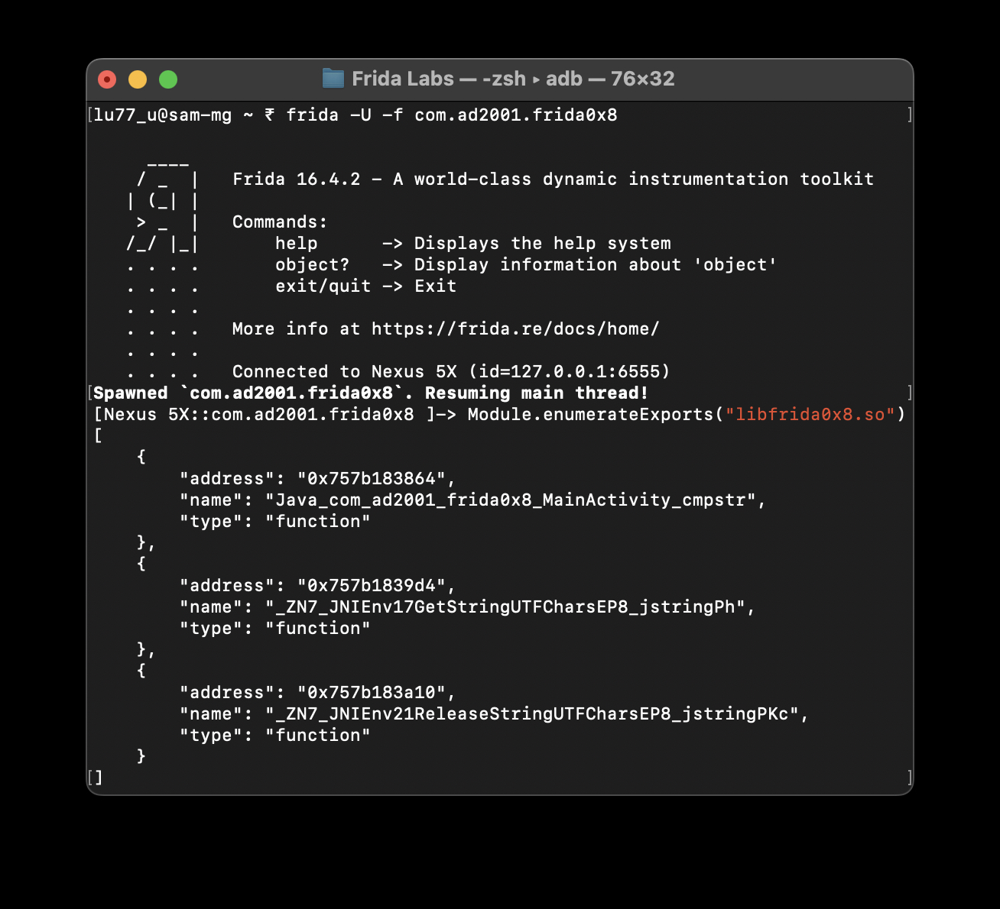
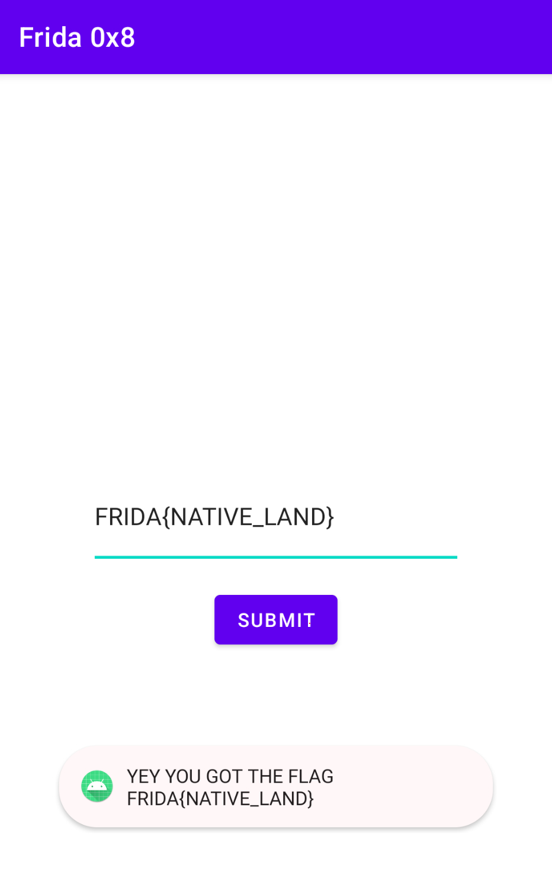

# Challenge 0x8

Let's break down this challenge and walk through how to solve it using Frida.
```java
public class MainActivity extends AppCompatActivity {
    public native int cmpstr(String str);
    static {
        System.loadLibrary("frida0x8");
    }
    @Override // androidx.fragment.app.FragmentActivity, androidx.activity.ComponentActivity, androidx.core.app.ComponentActivity, android.app.Activity
    public void onCreate(Bundle savedInstanceState) {
        button.setOnClickListener(new View.OnClickListener() { // from class: com.ad2001.frida0x8.MainActivity.1
            @Override // android.view.View.OnClickListener
            public void onClick(View v) {
                String ip = MainActivity.this.edt.getText().toString();
                int res = MainActivity.this.cmpstr(ip);
                if (res == 1) {
                    Toast.makeText(MainActivity.this, "YEY YOU GOT THE FLAG " + ip, 1).show();
                } else {
                    Toast.makeText(MainActivity.this, "TRY AGAIN", 1).show();
                }
            }
        });
    }
}
```
In this scenario, the flag-checking logic is embedded within the JNI (Java Native Interface) method `cmpstr()`. This means the actual validation occurs within the native code, specifically in the shared object (`.so`) file. To tackle this, we need to delve into the native code, using tools like IDA or Ghidra.

**Finding the Native Method**

To proceed, we first need to locate the `cmpstr()` method in the `.so` file. The goal is to identify the method name using Frida. Here's the process using `Module.enumerateExports(<.so_file_name>)`:


It is crucial to focus on finding the method name rather than the address, as the address may vary each time the library is loaded.

**Hooking the Native Method**

Once we've identified the function name, the next step is to use Frida to hook into the `cmpstr()` method:
```js
var strcmp_adr =  Module.enumerateExports("libfrida0x8.so")[0]["address"];
Interceptor.attach(strcmp_adr, {
    onEnter: function (args) {
    },
    onLeave: function (retval) {
    }
});
```
This is the foundational script. However, before we proceed, we need to pinpoint which argument contains the user input and which holds the flag.  

To do this, we inspect the arguments being passed into the method:
```js
var strcmp_adr =  Module.enumerateExports("libfrida0x8.so")[0]["address"];
Interceptor.attach(strcmp_adr, {
    onEnter: function (args) {
        var arg0 = Memory.readUtf8String(args[0]);
        if (arg0.includes("hello")) {
            send("agr[0]: Hello (User Input)");
        }
    },
    onLeave: function (retval) {
    }
});
```

With this script, we can identify which argument corresponds to the user input and then determine the flag:
```js
var strcmp_adr =  Module.enumerateExports("libfrida0x8.so")[0]["address"];
Interceptor.attach(strcmp_adr, {
    onEnter: function (args) {
        var arg0 = Memory.readUtf8String(args[0]);
        var arg1 = Memory.readUtf8String(args[1]);
        if (arg0 === "") {
            send("agr[0]: (User Input)");
            send("arg[1]: "+ arg1);
        }
    },
    onLeave: function (retval) {
    }
});
```

Through this process, we discover that the flag is `FRIDA{NATIVE_LAND}`. Entering this flag into the application provides the desired output:


While alternative methods, such as using a Python script for decryption, exist:
```py
print(''.join(chr(ord(char) - 1) for char in "GSJEB|OBUJWF`MBOE~"))
```
Frida offers a more hands-on approach, allowing us to dive deep into the application's behavior and gain valuable experience in manipulating Android native methods.

Happy hooking!