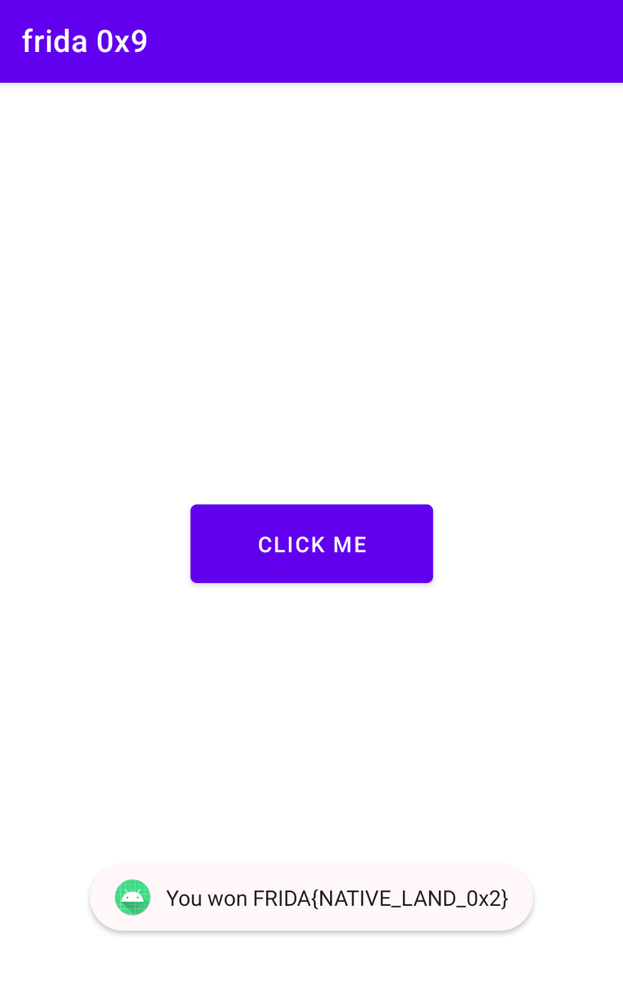

# Challenge 0x9

Let's break down this challenge and walk through how to solve it using Frida.
```java
public class MainActivity extends AppCompatActivity {
    public native int check_flag();
    static {
        System.loadLibrary("a0x9");
    }
    @Override // androidx.fragment.app.FragmentActivity, androidx.activity.ComponentActivity, androidx.core.app.ComponentActivity, android.app.Activity
    public void onCreate(Bundle savedInstanceState) {
        button.setOnClickListener(new View.OnClickListener() { // from class: com.ad2001.a0x9.MainActivity.1
            @Override // android.view.View.OnClickListener
            public void onClick(View v) {
                if (MainActivity.this.check_flag() == 1337) {
                    try {
                        Toast.makeText(MainActivity.this.getApplicationContext(), "You won " + decrypted, 1).show();
                        return;
                    }
                }
            }
            Toast.makeText(MainActivity.this.getApplicationContext(), "Try again", 1).show();
        });
    }
}
```

In this code, the `check_flag()` method, which resides in the native library, returns an integer that is compared to `1337`. If the comparison is true, the flag is decrypted and displayed.

Upon inspecting the native code using a disassembler like IDA, we find the following pseudocode:
```c
int Java_com_ad2001_a0x9_MainActivity_check_1flag(){
    return 1;
}
```
This indicates that the `check_flag()` method is hardcoded to return `1`. To get the flag, we need to intercept this return value and modify it to return `1337`.

Using Frida, we can hook into the `check_flag()` function and alter its return value. Here’s the script to do that:
```js
var ch_fg =  Module.enumerateExports("liba0x9.so")[0]['address']
Interceptor.attach(ch_fg, {
    onEnter: function (args) {
    },
    onLeave: function (retval) {
        retval.replace(1337)
    }
});
```
After running the script, the application will interpret the modified return value as `1337`, leading to the successful decryption and display of the flag.


Happy hooking!