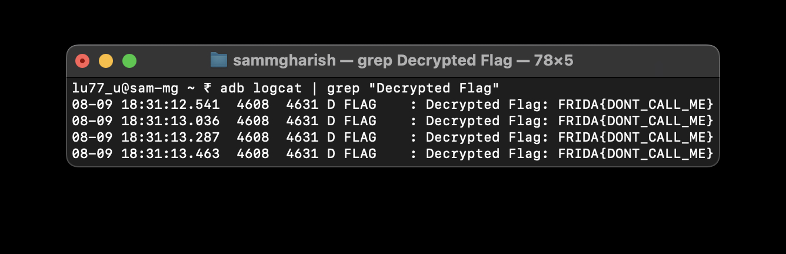

# Challenge 0xA

Let's break down this challenge and walk through how to solve it using Frida.
```java
public final class MainActivity extends AppCompatActivity {
    public final native String stringFromJNI();
    @Override // androidx.fragment.app.FragmentActivity, androidx.activity.ComponentActivity, androidx.core.app.ComponentActivity, android.app.Activity
    public void onCreate(Bundle savedInstanceState) {
        activityMainBinding.sampleText.setText(stringFromJNI());
    }
    static {
        System.loadLibrary("frida0xa");
    }
}
```

In this challenge, the `stringFromJNI()` method is called to set some text in the UI, but there's no indication of any flag-related functionality within the visible Java code. However, we can look deeper into the native library (`libfrida0xa.so`) using a disassembler like IDA or Ghidra.

Upon inspecting the `.so` file, we find an interesting method named `get_flag()`, which isn't invoked anywhere in the Java code. This suggests that `get_flag()` holds the key to retrieving the flag.

Using Frida, we can directly invoke the `get_flag()` method from the native library. Below is the script to achieve this:
```js
var get_flag_adr =  Module.enumerateExports("libfrida0xa.so")[137]["address"]
var native_ptr = new NativePointer(get_flag_adr);
const get_flag = new NativeFunction(native_ptr, "void", ['int', 'int']);
get_flag(1,2);
```

After executing the script, the result (likely the flag) will be logged to the Android system log. You can view this by running:
```bash
adb logcat
```


This approach demonstrates how you can leverage Frida to interact with native methods, even those not explicitly called within the Java code.

Happy hooking!