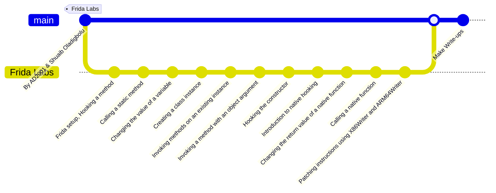

# Frida Labs

Frida Labs is a collection of challenges designed to help you learn and master Frida and dynamic hooking techniques. Each challenge presents a scenario where you can apply Frida's powerful instrumentation capabilities to explore, analyze, and manipulate applications.

> The purpose of this repository is to document solutions to these challenges, providing insights and guidance on how to effectively use Frida for security research and reverse engineering.

## What is Frida?

[Frida](https://frida.re/) is a dynamic instrumentation toolkit that allows you to see what's happening inside other programs or apps in real-time. It's like having a window into an application's inner workings, enabling you to:

- **Intercept Function Calls**: Hook into specific functions or methods and modify their behavior or examine the data they handle.
- **Observe and Modify**: Watch the application's execution in real-time, see variable values, and alter data or code as it's running.
- **Debugging and Reverse Engineering**: Useful for diagnosing issues, uncovering vulnerabilities, and performing security analysis without needing access to the original source code.
- **Dynamic Analysis**: Analyze compiled code dynamically, making it ideal for closed-source applications.

## Setup

To get started with Frida, follow these steps:

1. **Install Frida Tools**:
    Install the Frida tools using `pip`:
    ```bash
    pip install frida-tools
    ```

2. **Download and Install Frida Server**:
    - Download the appropriate Frida server for your device architecture from the [Frida releases page](https://github.com/frida/frida/releases).
    - If you're using an emulator (e.g., x86), download the x86 version. For ARM devices, download the corresponding ARM server.

    Determine your device's architecture using:
    ```bash
    adb shell getprop ro.product.cpu.abi
    ```
    For convenience, rename the server file:
    ```bash
    mv frida-server-<version>-android-<architecture> frida-server
    ```
    Push the Frida server to your device:
    ```bash
    adb push frida-server /data/local/tmp
    ```

    Grant executable permissions:
    ```bash
    adb shell
    cd /data/local/tmp
    chmod +x frida-server
    ```

3. **Run Frida Server in the Background**:
    To start the Frida server in the background using `adb`, use:
    ```bash
    adb shell /data/local/tmp/frida-server -D &
    ```

4. **Terminate the Frida Server**:
    To terminate the Frida server using `adb`, use the following command:
    ```bash
    adb shell kill $(adb shell ps | grep "frida-server" | awk '{print $2}')
    ```

## Basic Usage

To interact with Frida and your device, you can use the following commands:

- **List Processes**:
    Retrieve a list of running processes on your device:
    ```bash
    frida-ps -Ua
    ```
    - `-U`: List processes on a USB-connected device.
    - `-a`: Include all processes.

- **Run Hooking Functions**:
    To execute a Frida script that performs specific hooking functions, use:
    ```bash
    frida -U -f <package_name> -l <script.js>
    ```
    - `-f <package_name>`: Attach to a specific package.
    - `-l <script.js>`: Load and execute the specified Frida script.


Explore the provided solutions and scripts to learn how to apply Frida’s features to various challenges. Each script and write-up in this repository demonstrates practical techniques and insights into dynamic instrumentation.

## Workflow


Happy learning!