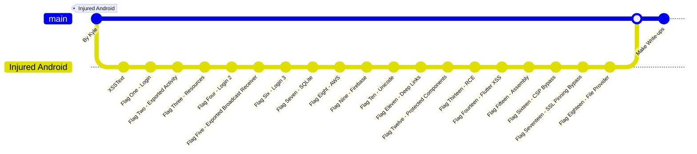

# Injured Android

This directory contains my write-ups for `Injured Android`. You can download the APK from the [Play Store](https://play.google.com/store/apps/details?id=b3nac.injuredandroid) or directly from [here](./Files/Injured_Android.apk).

## Workflow

Happy learning!