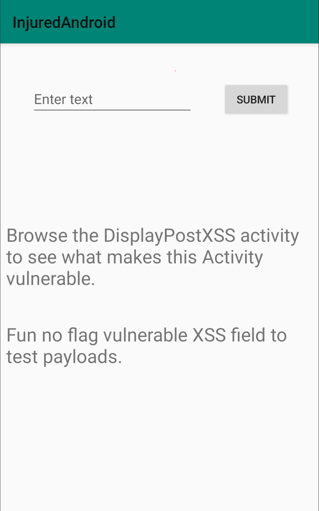
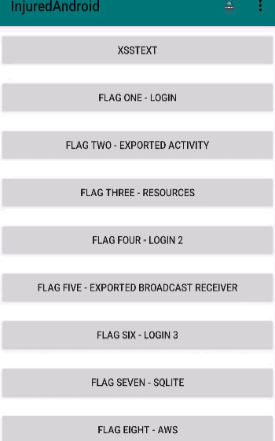

# XSSText

The first level of our analysis involves examining the `XSSText` activity. Upon entering this activity, the following screen is displayed:


Following the instructions, we delve into the `DisplayPostXSS` activity.  
Below is the critical section of the code:
```java
public final class DisplayPostXSS extends ActivityC0242c {
    public void onCreate(Bundle bundle) {
        super.onCreate(bundle);
        WebView webView = new WebView(this);
        setContentView(webView);
        String stringExtra = getIntent().getStringExtra("com.b3nac.injuredandroid.DisplayPostXSS");
        WebSettings settings = webView.getSettings();
        C1843g.m8724d(settings, "vulnWebView.settings");
        settings.setJavaScriptEnabled(true);
        webView.setWebChromeClient(new WebChromeClient());
        webView.loadData(stringExtra, "text/html", "UTF-8");
    }
}
```

The code snippet reveals that JavaScript is enabled within the WebView component. This setting opens the door to potential Cross-Site Scripting (XSS) attacks, as arbitrary JavaScript code can be executed.

To test this, we can inject a simple JavaScript code snippet:
```js
<script>
    var userInput = prompt('Please enter your name:');
    console.log('User input: ' + userInput);
    if (userInput) {
        alert('Your Name is ' + userInput );
    } else {
        alert('No name entered.');
    }
</script>
```

Upon injecting this script into the activity, we observe that the JavaScript executes successfully, confirming the presence of the XSS vulnerability.

Here is a GIF demonstrating the process:  


---
**Why is this happening?**  
This vulnerability occurs because the WebView is configured to enable JavaScript execution without any validation or sanitization of the input data. When user-provided input is directly loaded into the WebView using `loadData`, it can contain malicious scripts that will be executed.

**How is it happening?**  
The method `setJavaScriptEnabled(true)` in the WebView settings allows JavaScript to be executed within the WebView. Coupled with the absence of input sanitization, any data passed to the `DisplayPostXSS` activity can potentially include harmful scripts, leading to XSS attacks.

**How can it be prevented?**  
To prevent this type of vulnerability, consider the following steps:

1. **Input Validation and Sanitization:** Always validate and sanitize any input that will be displayed in the WebView. Use libraries or frameworks that can strip out malicious scripts from the input data.
2. **Disable JavaScript:** If JavaScript is not necessary for the WebView functionality, disable it by setting `setJavaScriptEnabled(false)`.
3. **Content Security Policy (CSP):** Implement a CSP to restrict the execution of scripts to only those that are trusted and approved.
4. **Use `loadDataWithBaseURL` Method:** This method provides more control over the loading process and can help in mitigating XSS by specifying a base URL and enforcing a more secure content loading policy.

---
By following these best practices, you can significantly reduce the risk of XSS vulnerabilities in your application.