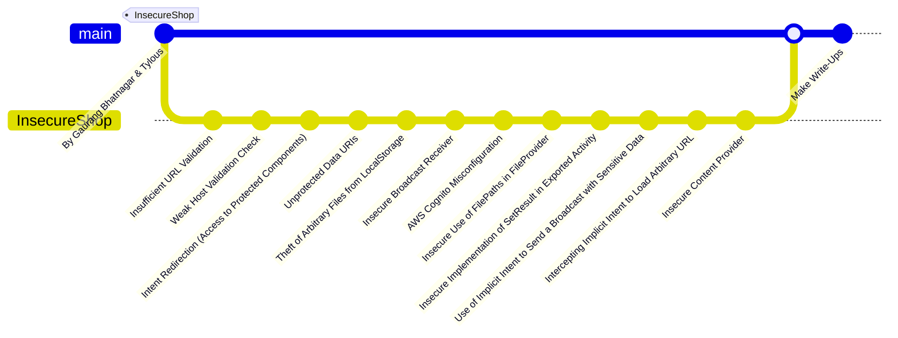

# InsecureShop

This directory contains my write-ups for the InsecureShop Android application, which has been intentionally designed to be insecure. You can download the APK from the [GitHub repository](https://github.com/hax0rgb/InsecureShop) or directly from [here](./Files/InsecureShop.apk).

## Workflow

Happy learning!