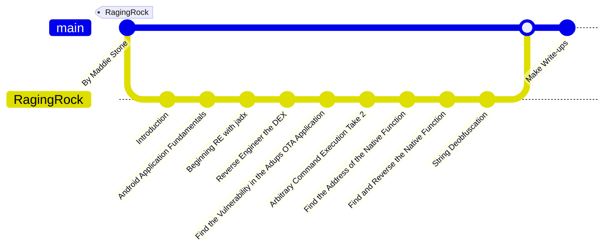

# RagingRock

This directory contains my solutions for the RagingRock Android App Reverse Engineering challenges. You can explore the challenges at [RagingRock Android App RE Challenge](https://www.ragingrock.com/AndroidAppRE/).

The creators have designed a series of Android APK challenges, packaged within `.vmdk` or `.ova` virtual machine files. These files are accessible to participants for solving the challenges. Unfortunately, `Mac` users like me face compatibility issues, but you can grab those files from [here](./Files/).

## Workflow

Happy learning!