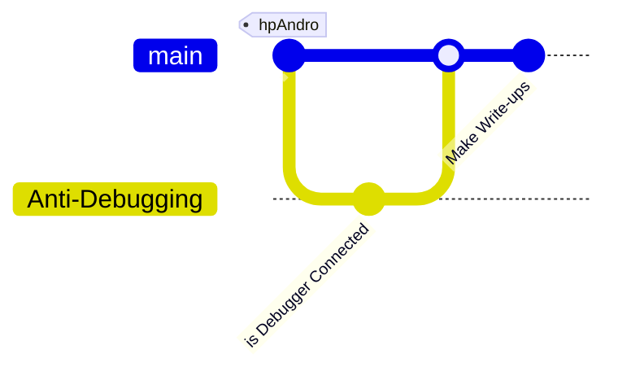

# hpAndro

## Anti-Debugging

```mermaid
gitGraph LR:
    commit id: " " tag: "hpAndro"
    branch "Anti-Debugging"
    checkout "Anti-Debugging"
    commit id: "is Debugger Connected"
    checkout "main"
    merge "Anti-Debugging"
    commit id: "Make Write-ups"
```

Happy learning!