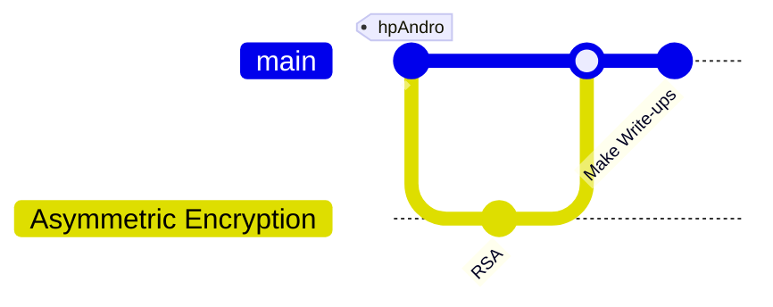

# hpAndro

## Asymmetric Encryption

```mermaid
gitGraph LR:
    commit id: " " tag: "hpAndro"
    branch "Asymmetric Encryption"
    checkout "Asymmetric Encryption"
    commit id: "RSA"
    checkout "main"
    merge "Asymmetric Encryption"
    commit id: "Make Write-ups"
```

Happy learning!