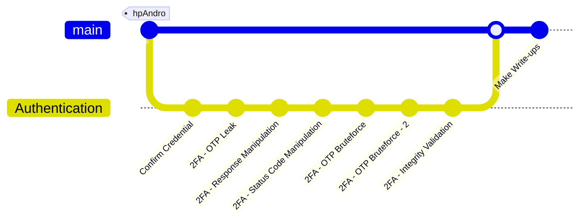

# hpAndro

## Authentication

```mermaid
gitGraph LR:
    commit id: " " tag: "hpAndro"
    branch "Authentication"
    checkout "Authentication"
    commit id: "Confirm Credential"
    commit id: "2FA - OTP Leak"
    commit id: "2FA - Response Manipulation"
    commit id: "2FA - Status Code Manipulation"
    commit id: "2FA - OTP Bruteforce"
    commit id: "2FA - OTP Bruteforce - 2"
    commit id: "2FA - Integrity Validation"
    checkout "main"
    merge "Authentication"
    commit id: "Make Write-ups"
```

Happy learning!