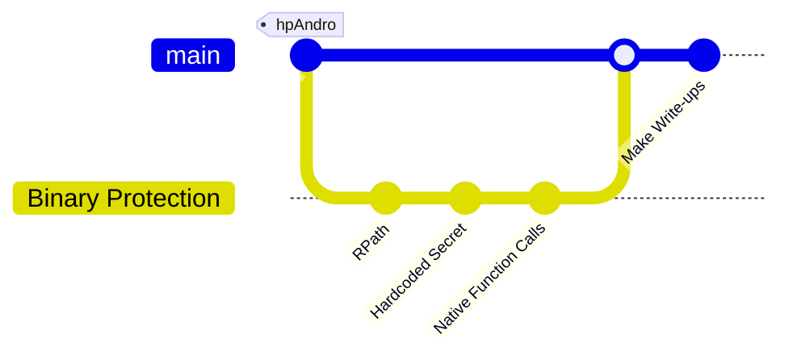

# hpAndro

## Binary Protection

```mermaid
gitGraph LR:
    commit id: " " tag: "hpAndro"
    branch "Binary Protection"
    checkout "Binary Protection"
    commit id: "RPath"
    commit id: "Hardcoded Secret"
    commit id: "Native Function Calls"
    checkout "main"
    merge "Binary Protection"
    commit id: "Make Write-ups"
```

Happy learning!