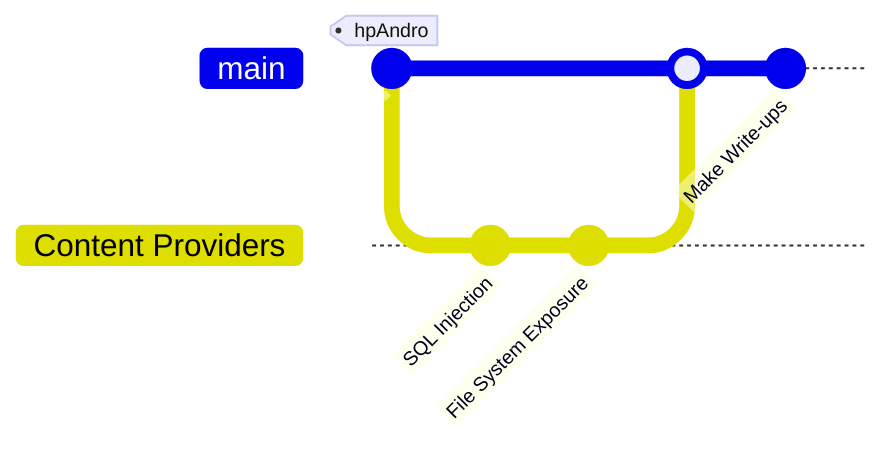

# hpAndro

## Content Providers

```mermaid
gitGraph LR:
    commit id: " " tag: "hpAndro"
    branch "Content Providers"
    checkout "Content Providers"
    commit id: "SQL Injection"
    commit id: "File System Exposure"
    checkout "main"
    merge "Content Providers"
    commit id: "Make Write-ups"
```

Happy learning!