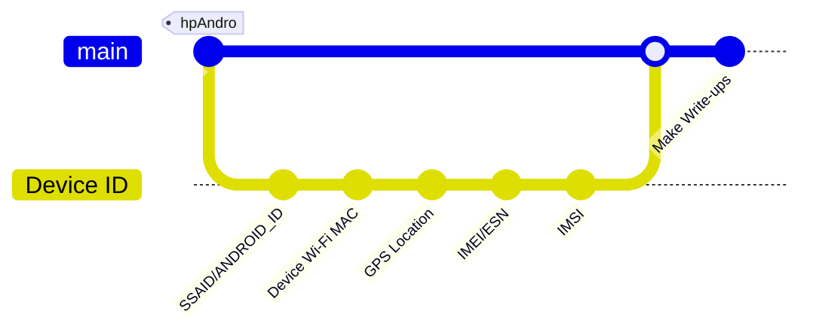

# hpAndro

## SSAID:Android ID

```mermaid
gitGraph LR:
    commit id: " " tag: "hpAndro"
    branch "Device ID"
    checkout "Device ID"
    commit id: "SSAID/ANDROID_ID"
    commit id: "Device Wi-Fi MAC"
    commit id: "GPS Location"
    commit id: "IMEI/ESN"
    commit id: "IMSI"
    checkout "main"
    merge "Device ID"
    commit id: "Make Write-ups"
```

Happy learning!