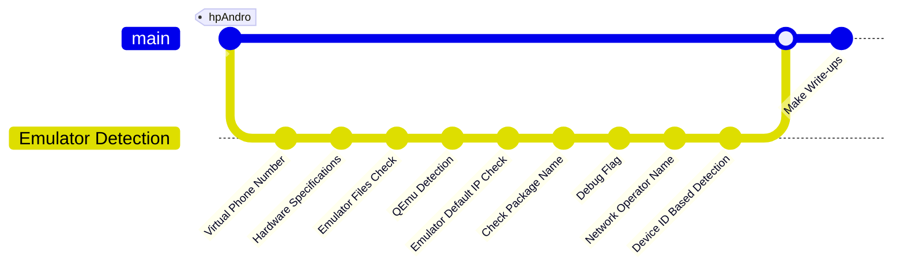

# hpAndro

## Emulator detection

```mermaid
gitGraph LR:
    commit id: " " tag: "hpAndro"
    branch "Emulator Detection"
    checkout "Emulator Detection"
    commit id: "Virtual Phone Number"
    commit id: "Hardware Specifications"
    commit id: "Emulator Files Check"
    commit id: "QEmu Detection"
    commit id: "Emulator Default IP Check"
    commit id: "Check Package Name"
    commit id: "Debug Flag"
    commit id: "Network Operator Name"
    commit id: "Device ID Based Detection"
    checkout "main"
    merge "Emulator Detection"
    commit id: "Make Write-ups"
```

Happy learning!