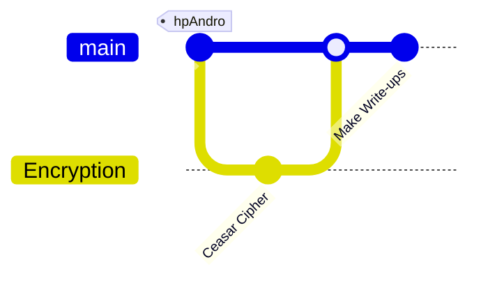

# hpAndro

## Encryption

```mermaid
gitGraph LR:
    commit id: " " tag: "hpAndro"
    branch "Encryption"
    checkout "Encryption"
    commit id: "Ceasar Cipher"
    checkout "main"
    merge "Encryption"
    commit id: "Make Write-ups"
```

Happy learning!