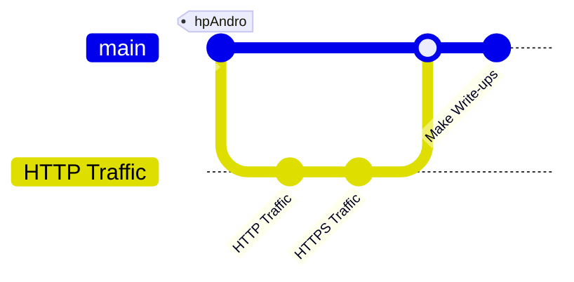

# hpAndro

## HTTP Traffic

```mermaid
gitGraph LR:
    commit id: " " tag: "hpAndro"
    branch "HTTP Traffic"
    checkout "HTTP Traffic"
    commit id: "HTTP Traffic" 
    commit id: "HTTPS Traffic"
    checkout main
    merge "HTTP Traffic"
    commit id: "Make Write-ups"
```

Happy learning!