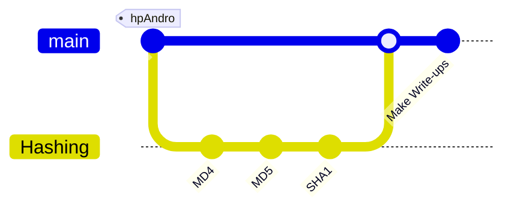

# hpAndro

## Hashing

```mermaid
gitGraph LR:
    commit id: " " tag: "hpAndro"
    branch "Hashing"
    checkout "Hashing"
    commit id: "MD4"
    commit id: "MD5"
    commit id: "SHA1"
    checkout "main"
    merge "Hashing"
    commit id: "Make Write-ups"
```

Happy learning!