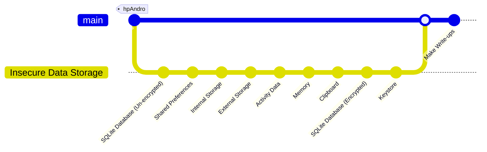

# hpAndro

## Insecure Data Storage

```mermaid
gitGraph LR:
    commit id: " " tag: "hpAndro"
    branch "Insecure Data Storage"
    checkout "Insecure Data Storage"
    commit id: "SQLite Database (Un-encrypted)"
    commit id: "Shared Preferences"
    commit id: "Internal Storage"
    commit id: "External Storage"
    commit id: "Activity Data"
    commit id: "Memory"
    commit id: "Clipboard"
    commit id: "SQLite Database (Encrypted)"
    commit id: "Keystore"
    checkout "main"
    merge "Insecure Data Storage"
    commit id: "Make Write-ups"
```

Happy learning!