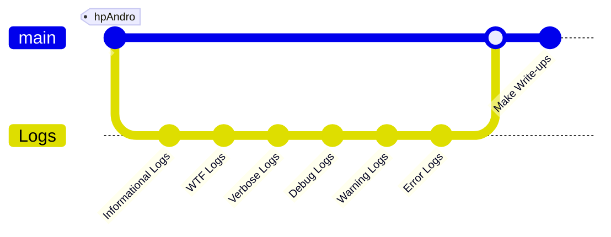

# hpAndro

## Logs

```mermaid
gitGraph LR:
    commit id: " " tag: "hpAndro"
    branch "Logs"
    checkout "Logs"
    commit id: "Informational Logs"
    commit id: "WTF Logs"
    commit id: "Verbose Logs"
    commit id: "Debug Logs"
    commit id: "Warning Logs"
    commit id: "Error Logs"
    checkout "main"
    merge "Logs"
    commit id: "Make Write-ups"
```

Happy learning!