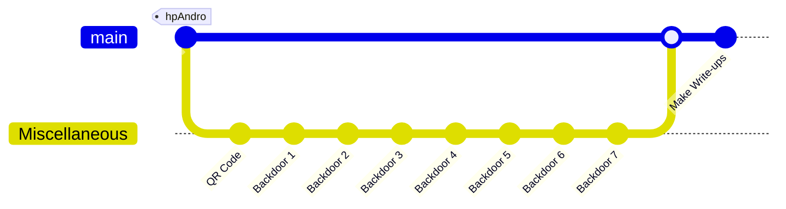

# hpAndro

## Miscellaneous

```mermaid
gitGraph LR:
    commit id: " " tag: "hpAndro"
    branch "Miscellaneous"
    checkout "Miscellaneous"
    commit id: "QR Code"
    commit id: "Backdoor 1"
    commit id: "Backdoor 2"
    commit id: "Backdoor 3"
    commit id: "Backdoor 4"
    commit id: "Backdoor 5"
    commit id: "Backdoor 6"
    commit id: "Backdoor 7"
    checkout "main"
    merge "Miscellaneous"
    commit id: "Make Write-ups"
```

Happy learning!