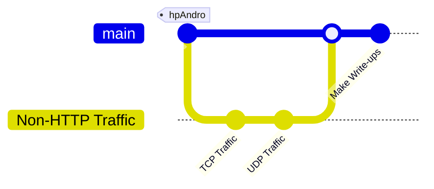

# hpAndro

## Non-HTTP Traffic

```mermaid
gitGraph LR:
    commit id: " " tag: "hpAndro"
    branch "Non-HTTP Traffic"
    checkout "Non-HTTP Traffic"
    commit id: "TCP Traffic"
    commit id: "UDP Traffic"
    checkout "main"
    merge "Non-HTTP Traffic"
    commit id: "Make Write-ups"
```

Happy learning!