# hpAndro

Welcome to the `hpAndro` directory! Here, you'll find detailed write-ups for various `hpAndro` challenges.

```mermaid
architecture-beta
    group hpAndro(logos:mdi:mobile-phone-key)[hpAndro]

    service _1(logos:curl)[HTTP Traffic] in hpAndro
    service _2(logos:mdi:lan)[Non HTTP Traffic] in hpAndro
    service _3(logos:mdi:file-document-multiple-outline)[Logs] in hpAndro
    service _4(logos:mdi:lock-outline)[Symmetric Encryption] in hpAndro
    service _5(logos:mdi:key-outline)[Asymmetric Encryption] in hpAndro
    service _6(logos:mdi:shield-key-outline)[Hashing] in hpAndro
    service _7(logos:mdi:web)[WebSocket Traffic] in hpAndro
    service _8(logos:mdi:web-box)[Web Application] in hpAndro
    service _9(logos:mdi:account-lock-outline)[Authentication] in hpAndro
    service _10(logos:mdi:android-debug-bridge)[Root Detection] in hpAndro
    service _11(logos:mdi:lock)[Encryption] in hpAndro
    service _12(logos:mdi:bug-outline)[Anti Debugging] in hpAndro
    service _13(logos:mdi:database-search)[Content Providers] in hpAndro
    service _14(logos:mdi:shield-lock-outline)[Binary Protection] in hpAndro
    service _15(logos:mdi:cube-outline)[Miscellaneous] in hpAndro
    service _16(logos:mdi:database-alert)[Insecure Data Storage] in hpAndro
    service _17(logos:mdi:cellphone-information)[Device ID] in hpAndro
    service _18(logos:mdi:android-studio)[Emulator Detection] in hpAndro
```

Feel free to explore each directory for its respective write-up. Dive in, learn, and enjoy the journey!

Happy learning!