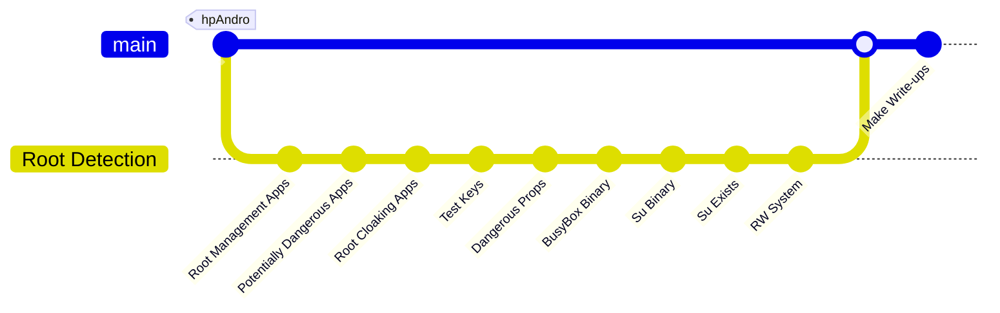

# hpAndro

## Root Detection

```mermaid
gitGraph LR:
    commit id: " " tag: "hpAndro"
    branch "Root Detection"
    checkout "Root Detection"
    commit id: "Root Management Apps"
    commit id: "Potentially Dangerous Apps"
    commit id: "Root Cloaking Apps"
    commit id: "Test Keys"
    commit id: "Dangerous Props"
    commit id: "BusyBox Binary"
    commit id: "Su Binary"
    commit id: "Su Exists"
    commit id: "RW System"
    checkout "main"
    merge "Root Detection"
    commit id: "Make Write-ups"
```

Happy learning!