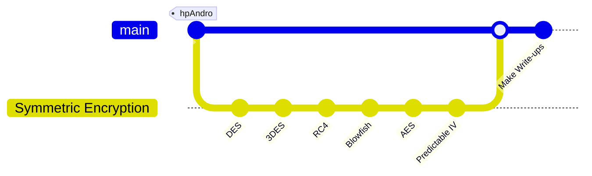

# hpAndro

## Symmetric Encryption

```mermaid
gitGraph LR:
    commit id: " " tag: "hpAndro"
    branch "Symmetric Encryption"
    checkout "Symmetric Encryption"
    commit id: "DES"
    commit id: "3DES"
    commit id: "RC4"
    commit id: "Blowfish"
    commit id: "AES"
    commit id: "Predictable IV"
    checkout "main"
    merge "Symmetric Encryption"
    commit id: "Make Write-ups"
```

Happy learning!