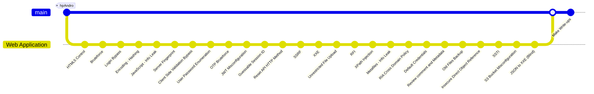

# hpAndro

## Web Application

```mermaid
gitGraph LR:
    commit id: " " tag: "hpAndro"
    branch "Web Application"
    checkout "Web Application"
    commit id: "HTML5 Control"
    commit id: "Bruteforce"
    commit id: "Login Bypass"
    commit id: "Encoding - Hashing"
    commit id: "JavaScript - Info Leak"
    commit id: "Server Fingerprint"
    commit id: "Client Side Validation Bypass"
    commit id: "User Password Enumeration"
    commit id: "OTP Bruteforce"
    commit id: "JWT Misconfiguration"
    commit id: "Guessable Session ID"
    commit id: "Reset API HTTP Method"
    commit id: "SSRF"
    commit id: "XXE"
    commit id: "Unrestricted File Upload"
    commit id: "RFI"
    commit id: "XPath Injection"
    commit id: "Metafiles - Info Leak"
    commit id: "RIA Cross Domain Policy"
    commit id: "Default Credentials"
    commit id: "Review comment and Metadata"
    commit id: "Old Files Backup"
    commit id: "Insecure Direct Object Reference"
    commit id: "SSTI"
    commit id: "S3 Bucket Misconfiguration"
    commit id: "JSON to XXE (Blind)"
    checkout "main"
    merge "Web Application"
    commit id: "Make Write-ups"
```

Happy learning!