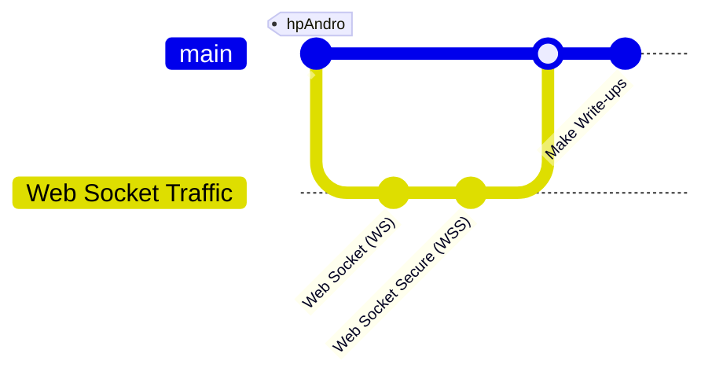

# hpAndro

## Web Socket Traffic

```mermaid
gitGraph LR:
    commit id: " " tag: "hpAndro"
    branch "Web Socket Traffic"
    checkout "Web Socket Traffic"
    commit id: "Web Socket (WS)"
    commit id: "Web Socket Secure (WSS)"
    checkout "main"
    merge "Web Socket Traffic"
    commit id: "Make Write-ups"
```

Happy learning!